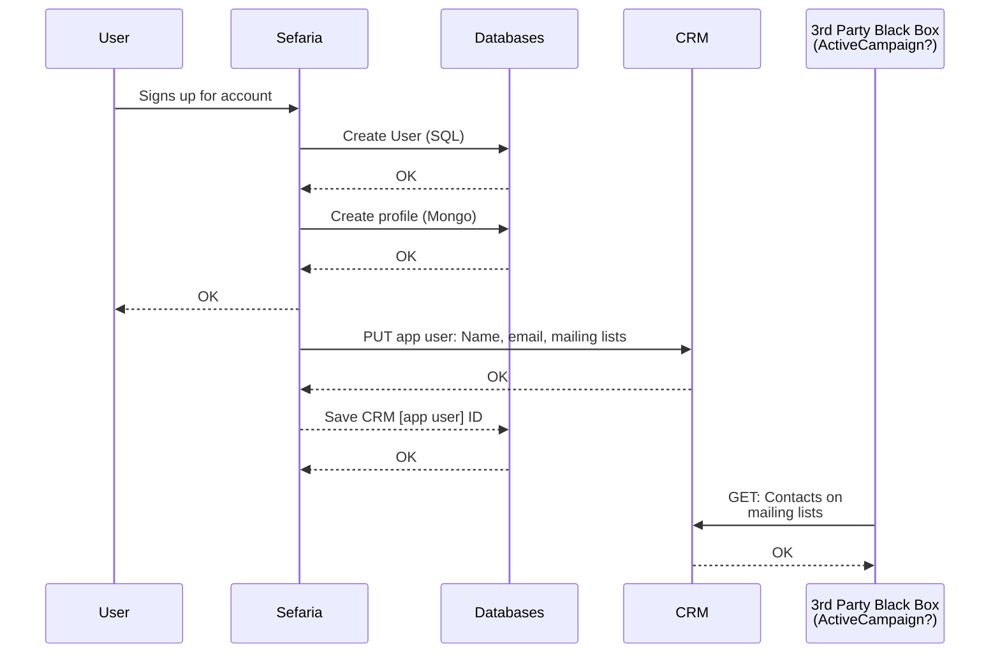
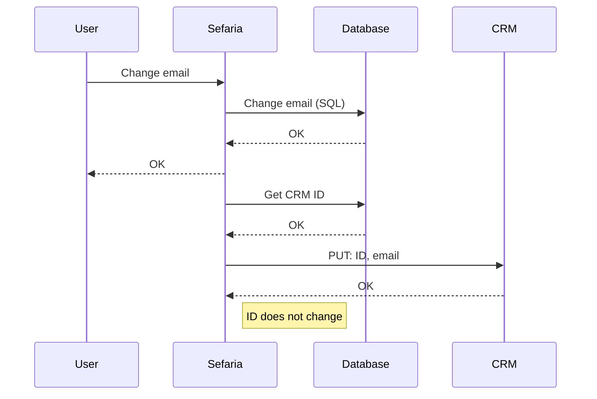
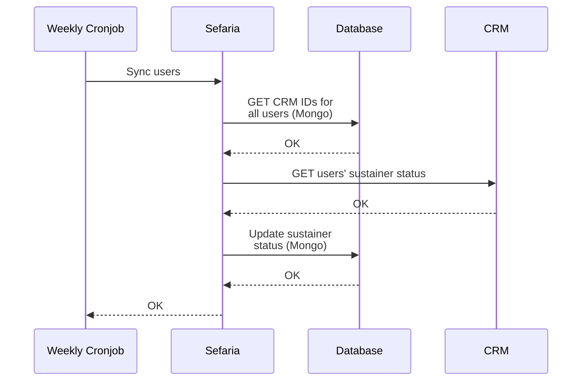
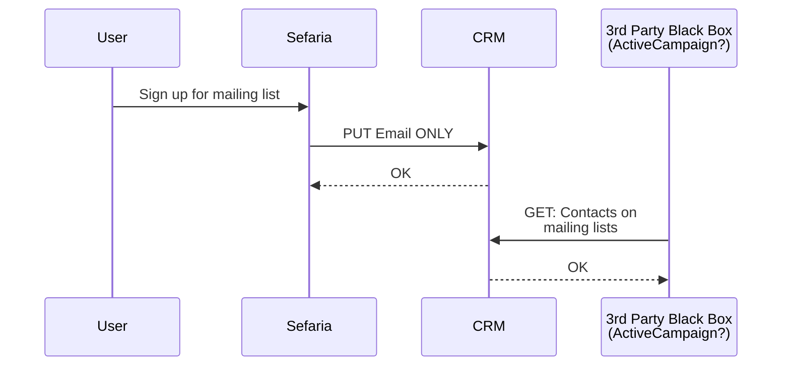

# CRM Interfaces

This attempts document the ways in which the Sefaria application interacts with the CRM. The document
attempts, as much as possible, to treat the CRM as a black box, and to merely document the types of information
that get sent to the CRM and what the business case for sending that information is.

To view mermaid diagrams in PyCharm, follow instructions here: 
https://www.jetbrains.com/go/guide/tips/mermaid-js-support-in-markdown/

## Diagrams - key

`User` - Human User of Sefaria Application

`Sefaria` - Sefaria application (backend)

`Databases` - Sefaria application databases (represents both the Mongo & the User/SQL DB)

`CRM` - Customer Relationship Management system. Black box (assumption is that the CRM interfaces with 3rd-party
systems: these are not documented here. We only document the interfaces with the CRM)

## User Sign-Up for Account

## User Changes Account Email
This is not currently implemented but should be implemented in salesforce.

## Syncing sustainers

## Someone signs up for a mailing list
Current implementation:

