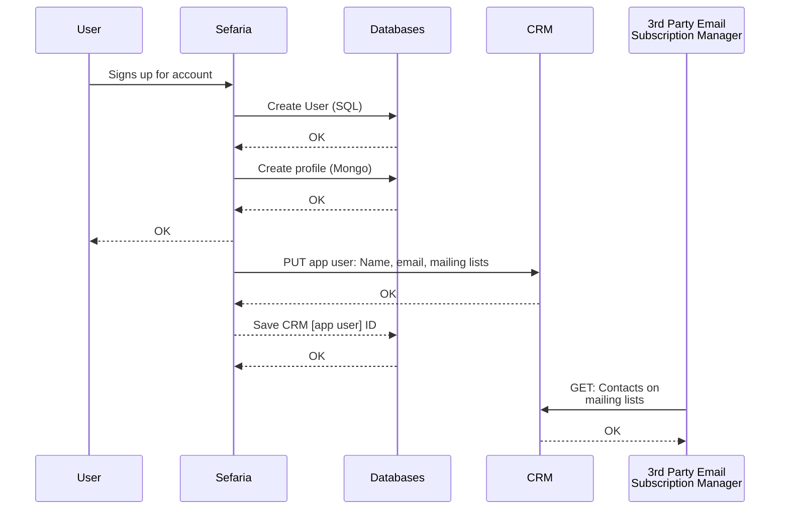
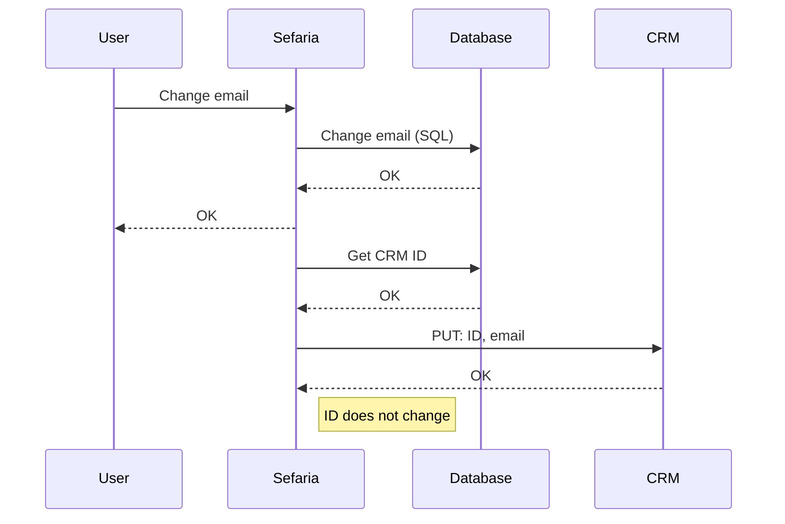
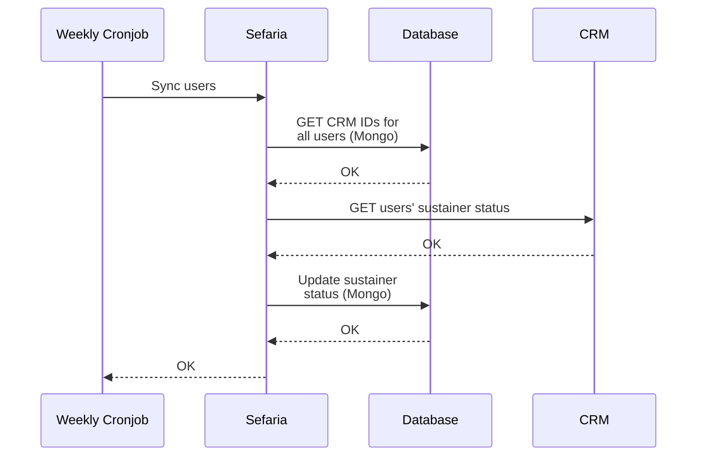
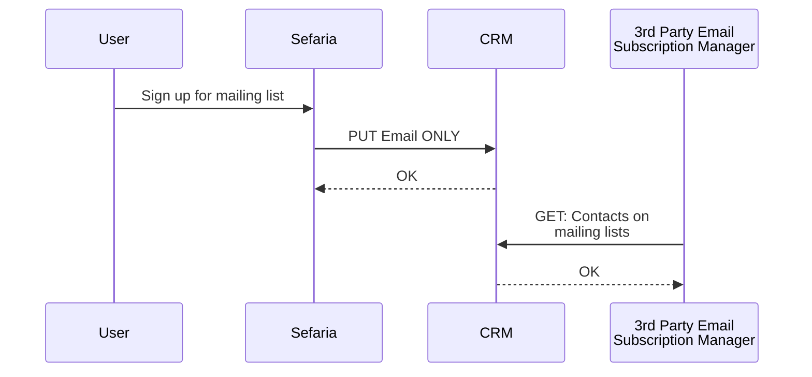

# CRM

This documents the ways in which the Sefaria application interacts with the CRM. It attempts, as much as possible,
to be written to be CRM platform-agnostic.

To view mermaid diagrams in PyCharm, follow instructions here: 
https://www.jetbrains.com/go/guide/tips/mermaid-js-support-in-markdown/

## CRM Interfaces
## Diagrams - key

`User` - Human User of Sefaria Application

`Sefaria` - Sefaria application (backend)

`Databases` - Sefaria application databases (represents both the Mongo & the User/SQL DB)

`CRM` - Customer Relationship Management system. Black box (assumption is that the CRM interfaces with 3rd-party
systems: these are not documented here. We only document the interfaces with the CRM)

## User Sign-Up for Account

After users successfully sign up for an account, the Sefaria App creates a request to store user data in the CRM.
Sefaria includes the necessary information to sign the user up for mailing lists based on interface language
and information provided during signup.

The Sefaria App should also store a unique identifier for accessing that app user's account on the CRM.

## User Changes Account Email
This is not currently implemented but should be implemented in the future. When the user changes their email,
Sefaria should request that the CRM keep track of the fact that the Sefaria App User has changed their email.

Whether or not making this request updates default emails and mailing list settings is implemented by the CRM. 

## Syncing sustainers
Each week, the Sefaria App pulls the sustainer status of Sefaria App Users and updates their sustainer status

## Someone signs up for a mailing list
This is the current set-up for users signing up for a mailing list. It goes through the CRM. It's possible
that we will change this.

