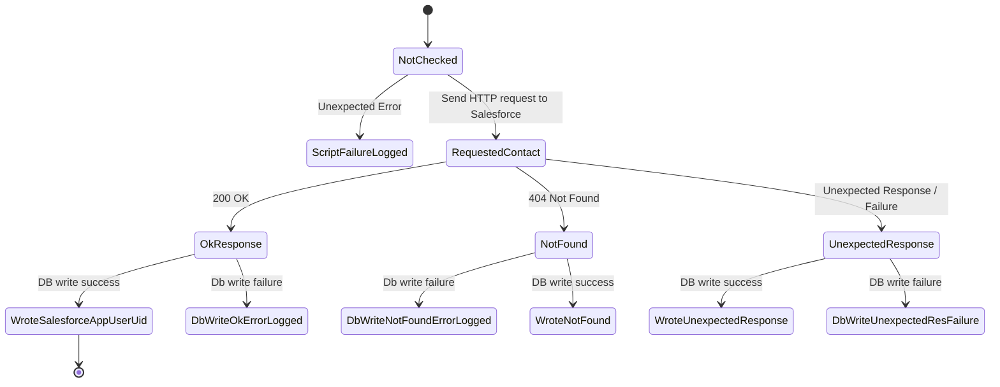
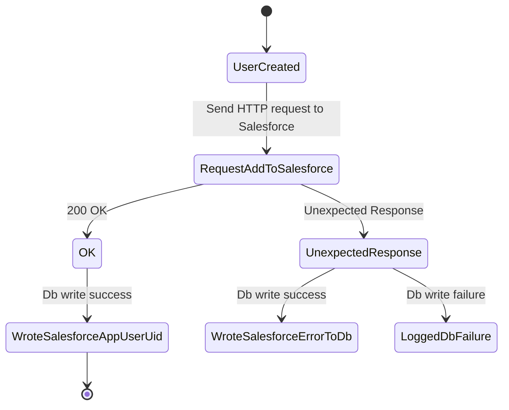
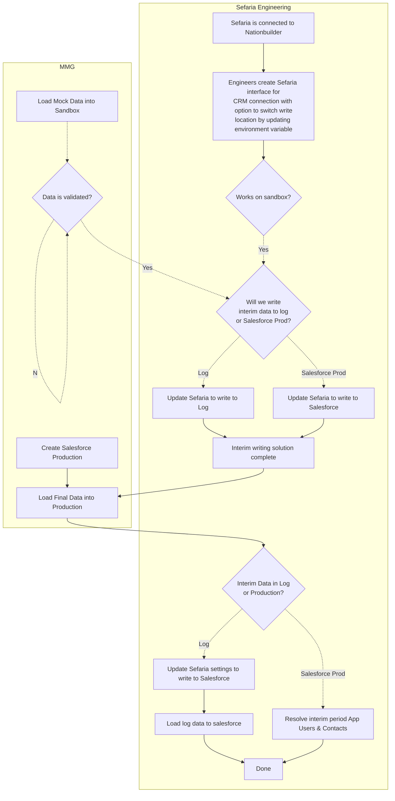
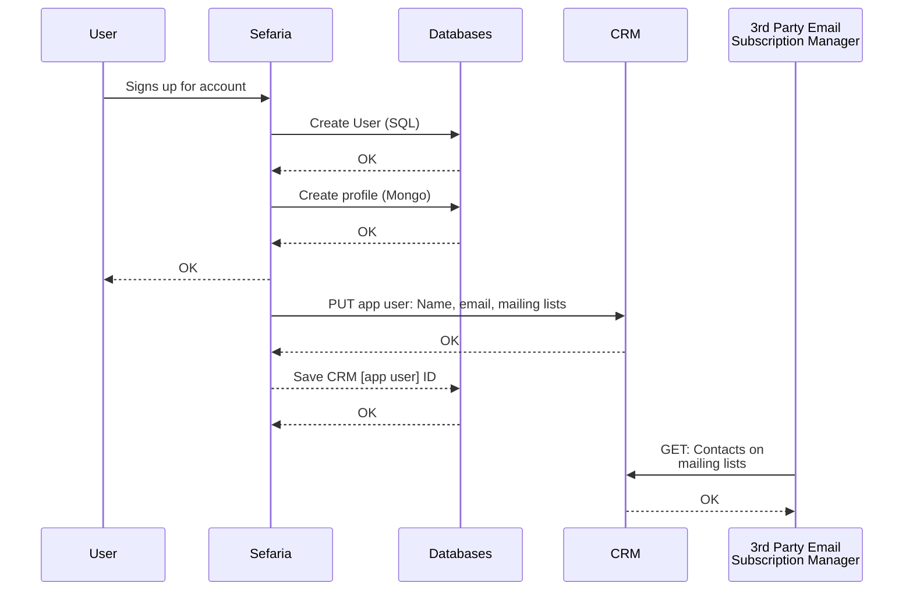
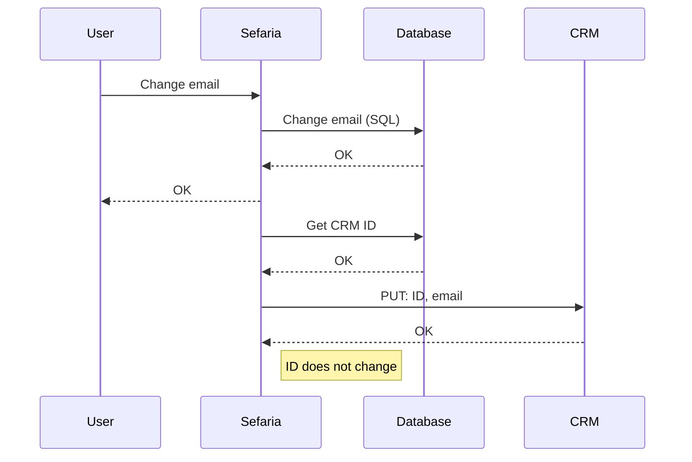
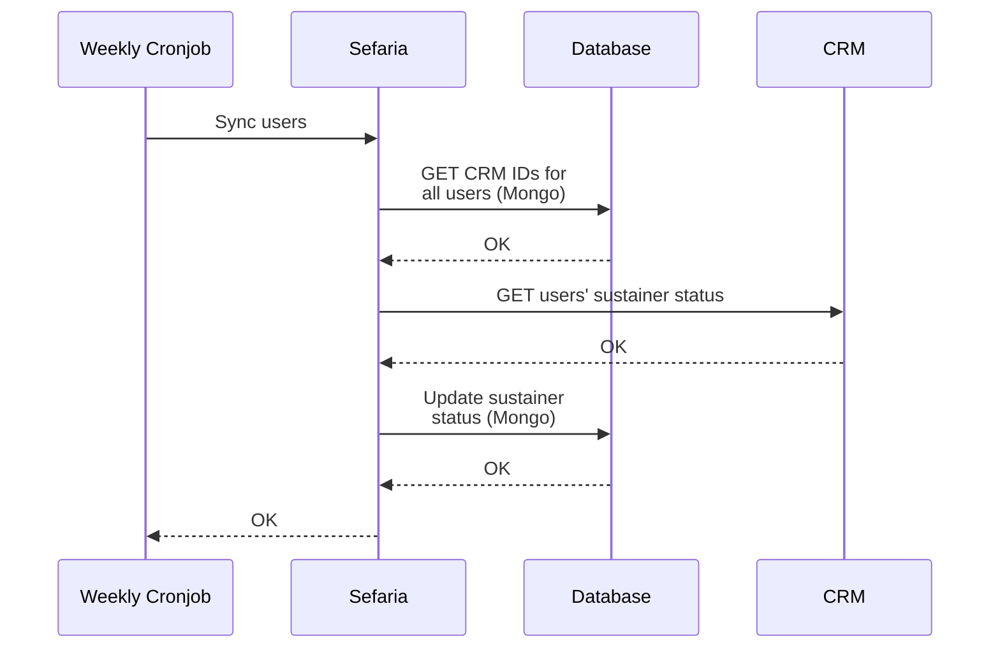
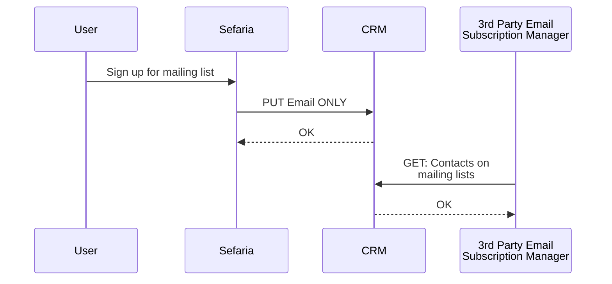
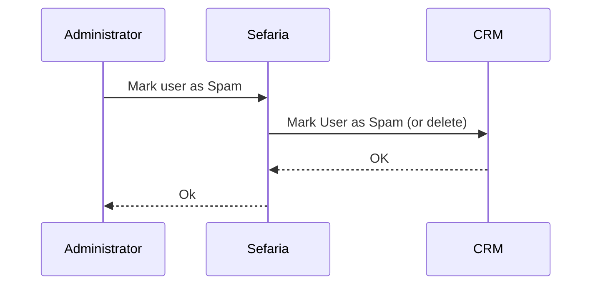

# CRM

This documents the ways in which the Sefaria application interacts with the CRM. There is also a section that 
documents the migration process.

To view mermaid diagrams in PyCharm, follow instructions here: 
https://www.jetbrains.com/go/guide/tips/mermaid-js-support-in-markdown/

## Post-Migration: Transition Diagrams for Profile States

### App Users that have a Nationbuilder ID.

Transition diagram describing the validation script on profiles where `nationbuilder_id` is truthy.

**IMPORTANT NOTE**: the mongo database should *only* store references to Salesforce UIDs for "app users," not the
contact those app users are associated with, as these are subject to change.

#### Handling "Failure States" for App Users that have a Nationbuilder ID

`ScriptFailureLogged` - The script to validate users did not complete. Debug errors and re-run script.

`DbWriteOkErrorLogged` - The user was found in Salesforce but there was an issue writing data to the database.
Manually resolve this (or write another script to handle these folks)

`WroteNotFound` - The user was not in Salesforce but has a Nationbuilder ID. This is a possible spam
user that was not deleted properly, OR there was an issue migrating the user. Create a CSV of these users and
make decision about how to resolve later (consulte MarComs). These have `NbProfileNotFoundInSalesforce-datetime`
in `CrmLog` field on Mongo.

`WroteUnexpectedResponse` - Manually look through these and figure out what went wrong. Should also probably log the
response.  These have `NbProfileUnexpectedRes-datetime: {error message}` in `CrmLog` on mongo.

`ErrorLogged` statuses - the response should have gotten written to Mongo but did not.
Pull these from logs and write to Mongo.

**NOTE:** Only after the failure states are handled can we remove nationbuilder_id from mongo.

### App Users migrated from Nationbuilder that don't have nationbuilder ID
This is being left as an open TODO. These folks will have to be resolved at some point, after a conversation
with MarComs.

### New Users who sign up for the App

### Note on resolving App Users with existing contacts
The resolution of App Users with existing contacts is handled solely on the Salesforce side, either by
automated flow or manual process. The Sefaria application does not handle the logic of whether
a new app user gets a new Contact profile created for it, or whether it gets associated with an existing
Contact profile. 

#### Handling "Failure States"
`WroteSalesforceErrorToDb` - These need to be checked and debugged.  They have
`NewUserSalesforceWriteError-datetime: {error message}` in their `CrmLog` on Mongo.

`LoggedDbFailure` - Manually resolve
 

## CRM Migration Process: Nationbuilder to Salesforce
Sefaria = Sefaria Application

## CRM Interfaces
The `CrmConnectionManager` base class defines methods to perform the following actions.

Concrete classes of `CrmConnectionManager` should implement a `get_connection` function that authenticates
the Sefaria application and returns a Requests session object.

## Diagrams - key

`User` - Human User of Sefaria Application

`Administrator` - Human administrator, likely someone who works at Sefaria

`Sefaria` - Sefaria application (backend)

`Databases` - Sefaria application databases (represents both the Mongo & the User/SQL DB)

`CRM` - Customer Relationship Management system. Assumption is that the CRM interfaces with 3rd-party
systems.

## User Sign-Up for Account

After users successfully sign up for an account, the Sefaria App creates a request to store user data in the CRM.
Sefaria includes the necessary information to sign the user up for mailing lists based on interface language
and information provided during signup.

The Sefaria App should also store a unique identifier for accessing that app user's account on the CRM.

This corresponds with the `CrmConnectionManager.add_user_to_crm` method

## User Changes Account Email
This is not currently implemented but should be implemented in the future. When the user changes their email,
Sefaria should request that the CRM keep track of the fact that the Sefaria App User has changed their email.

Whether or not making this request updates default emails and mailing list settings is implemented by the CRM.

This corresponds with the `CrmConnectionManager.change_user_email` method.

## Syncing sustainers
Each week, the Sefaria App pulls the sustainer status of Sefaria App Users and updates their sustainer status

This corresponds with the `CrmConnectionManager.sync_sustainers` method.

## Someone signs up for a mailing list
This is the current set-up for users signing up for a mailing list. It goes through the CRM. It's possible
that we will change this.

This corresponds with the `CrmConnectionManager.add_email_to_mailing_lists` method.

## User marked as spam

For Nationbuilder, this *deletes* the user.

When we move to Salesforce, we will want to implement something different. We still need spec.

This corresponds with the `CrmConnectionManager.mark_as_spam_in_crm` method.

